# String Patterns, Sorting and Grouping

## Create Tables for 'HR' Database - `Exercise-02-Create-Tables.sql`

```sql
------------------------------------------
--DDL statement for table 'HR' database--
--------------------------------------------

CREATE TABLE EMPLOYEES (
                            EMP_ID CHAR(9) NOT NULL, 
                            F_NAME VARCHAR(15) NOT NULL,
                            L_NAME VARCHAR(15) NOT NULL,
                            SSN CHAR(9),
                            B_DATE DATE,
                            SEX CHAR,
                            ADDRESS VARCHAR(30),
                            JOB_ID CHAR(9),
                            SALARY DECIMAL(10,2),
                            MANAGER_ID CHAR(9),
                            DEP_ID CHAR(9) NOT NULL,
                            PRIMARY KEY (EMP_ID));
                            
  CREATE TABLE JOB_HISTORY (
                            EMPL_ID CHAR(9) NOT NULL, 
                            START_DATE DATE,
                            JOBS_ID CHAR(9) NOT NULL,
                            DEPT_ID CHAR(9),
                            PRIMARY KEY (EMPL_ID,JOBS_ID));
 
 CREATE TABLE JOBS (
                            JOB_IDENT CHAR(9) NOT NULL, 
                            JOB_TITLE VARCHAR(15) ,
                            MIN_SALARY DECIMAL(10,2),
                            MAX_SALARY DECIMAL(10,2),
                            PRIMARY KEY (JOB_IDENT));

CREATE TABLE DEPARTMENTS (
                            DEPT_ID_DEP CHAR(9) NOT NULL, 
                            DEP_NAME VARCHAR(15) ,
                            MANAGER_ID CHAR(9),
                            LOC_ID CHAR(9),
                            PRIMARY KEY (DEPT_ID_DEP));

CREATE TABLE LOCATIONS (
                            LOCT_ID CHAR(9) NOT NULL,
                            DEP_ID_LOC CHAR(9) NOT NULL,
                            PRIMARY KEY (LOCT_ID,DEP_ID_LOC));
```

### Tables used in this Exercise

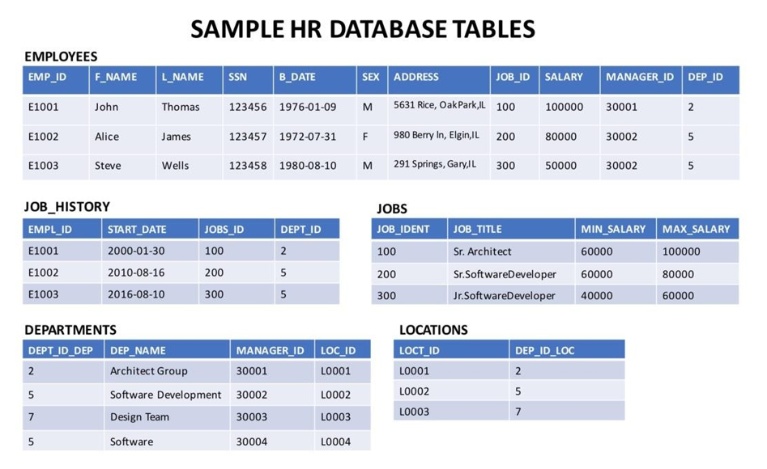

## Loading Data to IBM-Db2 Cloud

Please follow the steps below which explains the process of loading data into the tables we created earlier.

1. Download the 5 required data source files from the lab page in the course: **(Employees.csv,Departments.csv,Jobs.csv,JobsHistory.csv,Locations.csv)** to your computer:
2. First let us learn how to load data into the Employees table that we created earlier. From the 3 bar menu icon, select Load then Load Data:
    
    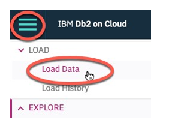
    
    On the Load page that opens ensure My Computer is selected as the source. Click on the browse files link.
    
    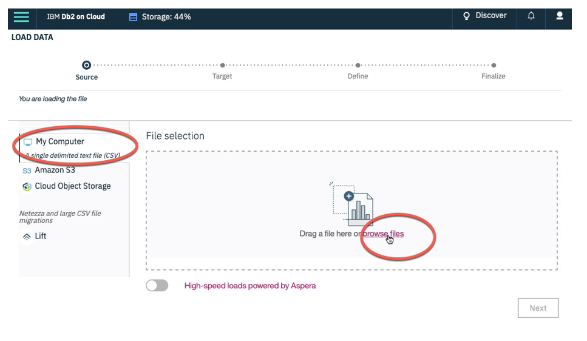
    
3. Choose the file `Emloyees.csv` that you downloaded to your computer and click Open.
    
    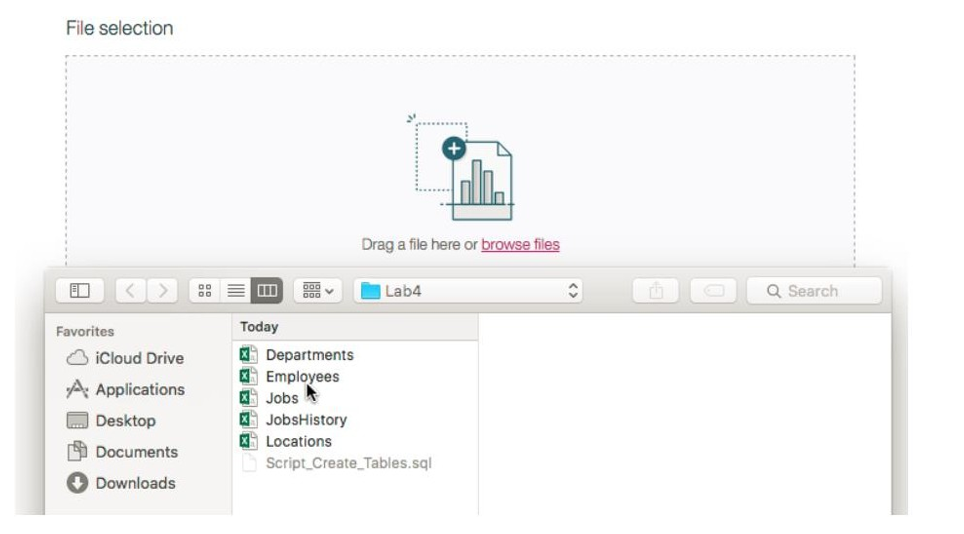
    
4. Once the File is selected click Next in the bottom right corner.
    
    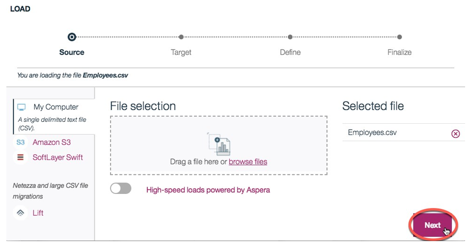
    
5. Select the schema for your Db2 Userid.
    
    **NOTE:** if you only see 2-3 schemas and not your Db2 schema then scroll down in that list till you see the desired one in which you previously created the tables.
    
    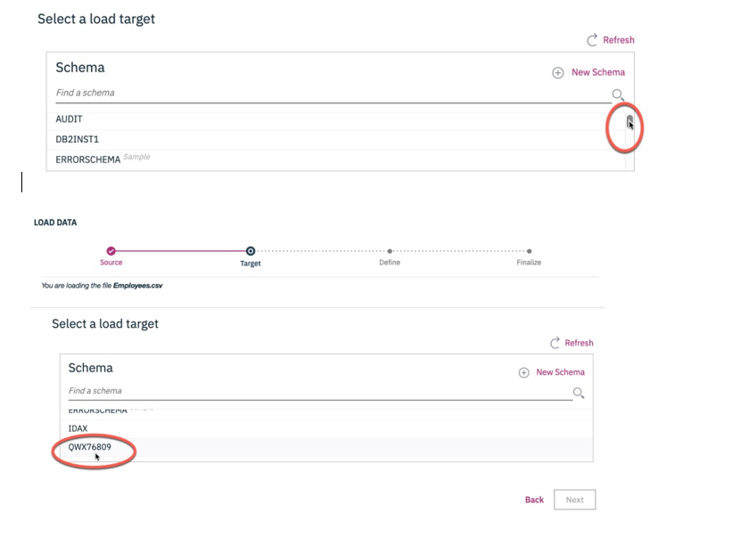
    
    It will show all the tables that have been created in this Schema previously, including the Employees table. Select the EMPLOYEES table, and choose Overwrite table with new data then click `Next`.
    
    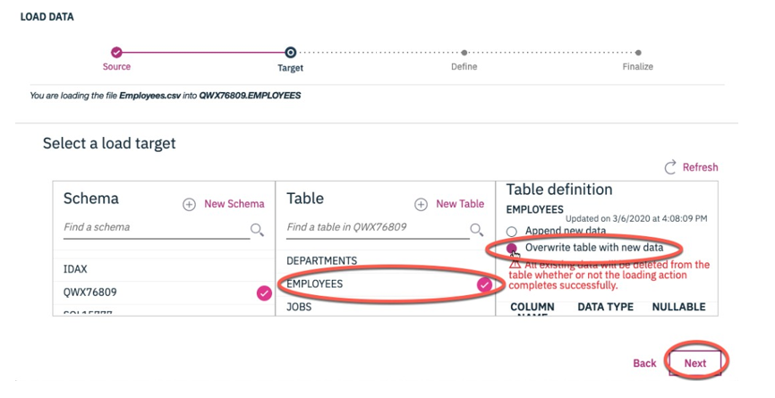
    
6. Since our source data files do not contain any rows with column labels, turn off the setting for Header in first row. Also, click on the down arrow next to Date format and choose `MM/DD/YYYY` since that is how the date is formatted in our source file.
    
    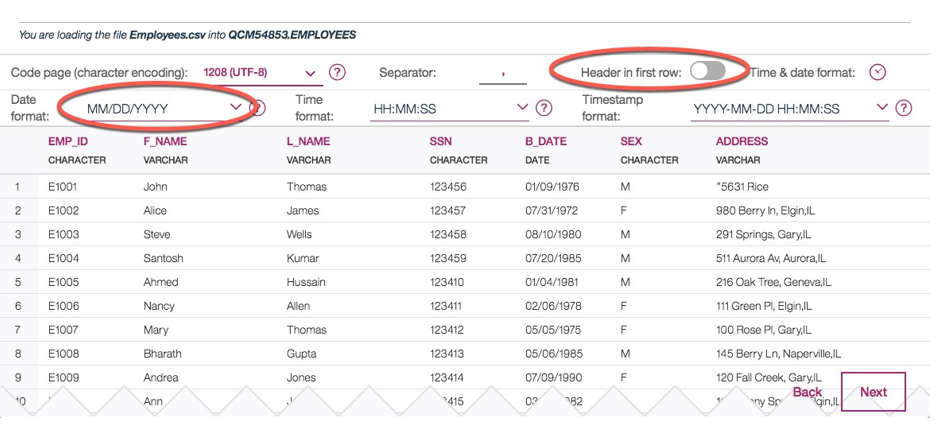
    
7. Click `Next`. Review the Load setting and click `Begin Load` in the top-right corner.
    
    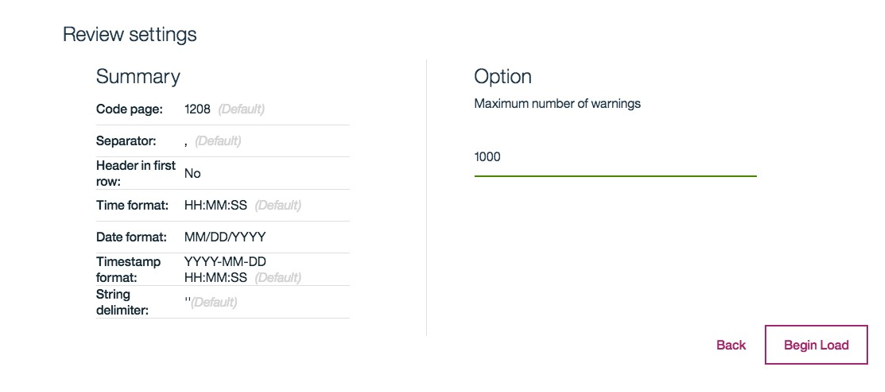
    
8. After Loading is complete you will notice that we were successful in loading all 10 rows of the Employees table. If there are any Errors or Warnings you can view them on this screen.
    
    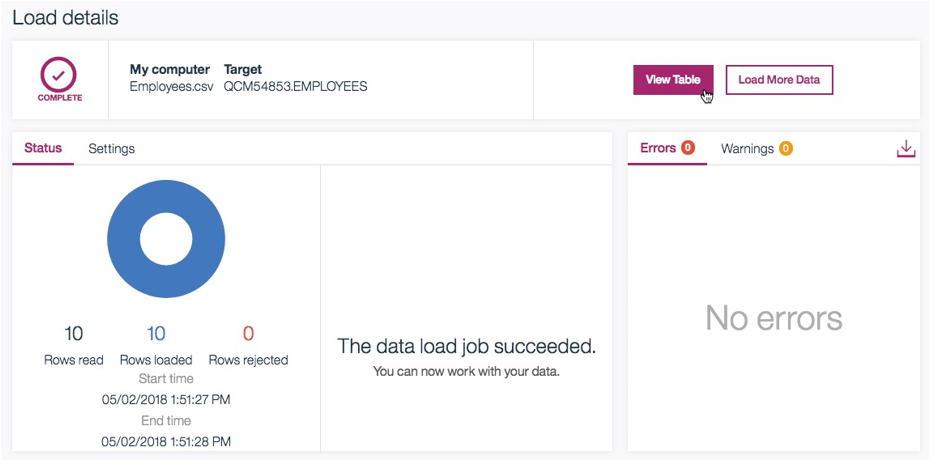
    
9. You can see the data that was loaded by clicking on the View Table. Alternatively you can go into the Explore page and page select the correct schema, then the EMPLOYEES table, and click `View Data`.
    
    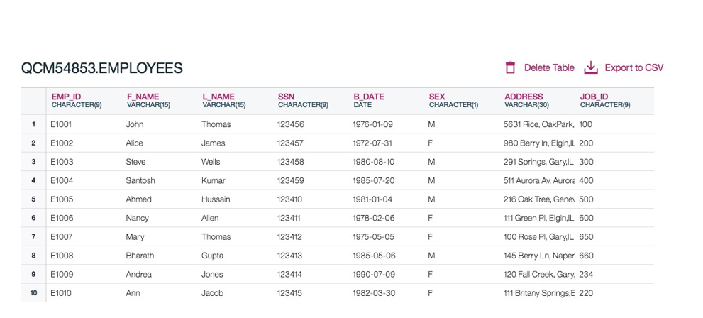
    
10. Now follow the same steps for remaining tables of HR database – Locations, JobHistory, Jobs, and Departments.

## Queries - `Exercise-02-Queries.sql`

**Query 1: Retrieve all employees whose address is in Elgin,IL**

```sql
--Query 1: Retrieve all employees whose address is in Elgin,IL
SELECT * FROM EMPLOYEES
WHERE ADDRESS LIKE '%Elgin,IL';
```

---

**Query 2: Retrieve all employees who were born during the 1970's.**

```sql
--Query 2: Retrieve all employees who were born during the 1970's
SELECT * FROM EMPLOYEES
WHERE B_DATE LIKE '197%';
```

---

**Query 3: Retrieve all employees in department 5 whose salary is between 60000 and 70000 .**

```sql
SELECT * FROM EMPLOYEES
WHERE DEP_ID = 5 AND (SALARY BETWEEN 60000 AND 70000);
```

---

**Query 4A: Retrieve a list of employees ordered by department ID.**

```sql
--Query 4A: Retrieve a list of employees ordered by department ID.
SELECT * FROM EMPLOYEES
ORDER BY DEP_ID;
```

---

**Query 4B: Retrieve a list of employees ordered in descending order by department ID and within each department ordered alphabetically in descending order by last name.**

```sql
--Query 4B: Retrieve a list of employees ordered in descending order by department ID and within each department ordered alphabetically in descending order by last name.
SELECT * FROM EMPLOYEES
ORDER BY DEP_ID DESC, L_NAME DESC;
```

---

**Query 5A: For each department ID retrieve the number of employees in the department.**

```sql
--Query 5A: For each department ID retrieve the number of employees in the department.
SELECT DEP_ID, COUNT(*)
FROM EMPLOYEES
GROUP BY DEP_ID;
```

---

**Query 5B: For each department retrieve the number of employees in the department, and the average employees salary in the department.**

```sql
--Query 5B: For each department retrieve the number of employees in the department, and the average employees salary in the department.
SELECT DEP_ID, COUNT(*), AVG(SALARY)
FROM EMPLOYEES
GROUP BY DEP_ID;
```

---

**Query 5C: Label the computed columns in the result set of Query 5B as `NUM_EMPLOYEES` and `AVG_SALARY`.**

```sql
--Query 5C: Label the computed columns in the result set of Query 5B as NUM_EMPLOYEES and AVG_SALARY.
SELECT DEP_ID, COUNT(*) AS "NUM_EMPLOYEES", AVG(SALARY) AS "AVG_SALARY"
FROM EMPLOYEES
GROUP BY DEP_ID;
```

---

**Query 5D: In Query 5C order the result set by Average Salary.**

```sql
--Query 5D: In Query 5C order the result set by Average Salary.
SELECT DEP_ID, COUNT(*) AS "NUM_EMPLOYEES", AVG(SALARY) AS "AVG_SALARY"
FROM EMPLOYEES
GROUP BY DEP_ID
ORDER BY AVG_SALARY;
```

---

**Query 5E: In Query 5D limit the result to departments with fewer than 4 employees.**

```sql
--Query 5E: In Query 5D limit the result to departments with fewer than 4 employees.
SELECT DEP_ID, COUNT(*) AS "NUM_EMPLOYEES", AVG(SALARY) AS "AVG_SALARY"
FROM EMPLOYEES
GROUP BY DEP_ID
HAVING COUNT(*) < 4 
ORDER BY AVG_SALARY;
```

---

**Query 6: Similar to 4B but instead of department ID use department name. Retrieve a list of employees ordered by department name, and within each department ordered alphabetically in descending order by last name.**

```sql
--Query 6: Similar to 4B but instead of department ID use department name. Retrieve a list of employees ordered by department name, and within each department ordered alphabetically in descending order by last name.
SELECT D.DEP_NAME , E.F_NAME, E.L_NAME
FROM EMPLOYEES AS E, DEPARTMENTS AS D
WHERE E.DEP_ID = D.DEPT_ID_DEP
ORDER BY D.DEP_NAME, E.L_NAME DESC;
```

---